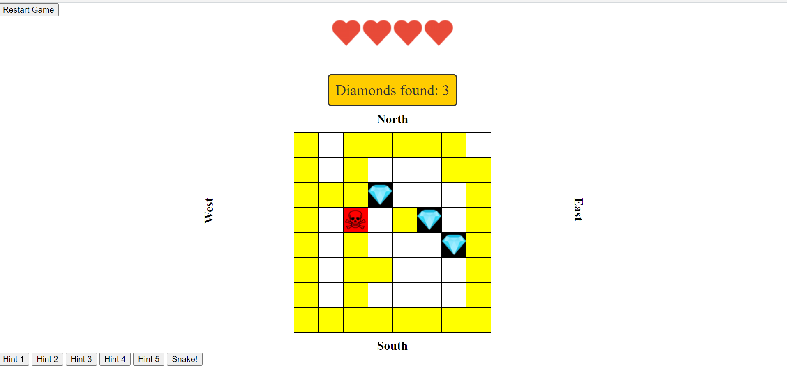

# Diamond Hunter Game

**Diamond Hunter** is a fun and challenging web-based game where your goal is to find five hidden diamonds on the game board while avoiding hidden skulls. You'll have five lives to complete the task, and you can use hints and a special "Snake" feature to help you on your adventure.

## How to Play

1. Click on the cells on the game board to reveal hidden items.
2. Your objective is to find all five diamonds without revealing five skulls.
3. You start the game with five lives, and you lose a life each time you reveal a skull.
4. Use the provided hints to get clues about the locations of diamonds.
5. Be strategic, and use the "Snake" feature to reveal a path that connects all diamonds while touching the boundaries.

## Features

- **Hints:** There are four hints available to help you locate diamonds in different areas of the board: North-West, North-East, South-East, and South-West. Additionally, there's a fifth hint for the Middle position.
- **Cheat Code:** Press Shift + Ctrl to reveal all diamonds (cheat code).
- **Snake:** Use the "Snake" button to draw a path on the board that connects all diamonds while touching each direction boundary.

## Controls

- Click on cells to reveal hidden items.
- Click "Restart Game" to start a new game.
- Use hints to get clues about diamond locations.
- Click "Snake" to draw a path that connects all diamonds.

## Installation

1. Clone this repository to your local machine.
2. Open the `index.html` file in a web browser to play the game.

## Acknowledgments

- Special thanks to [Sk. Farhad Kamal](https://github.com/FarhadKamal) for creating this game.

Have fun playing Diamond Hunter and challenge yourself to find all the diamonds while avoiding the skulls!

